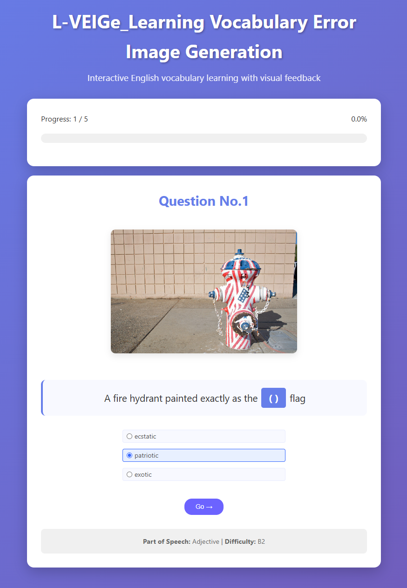
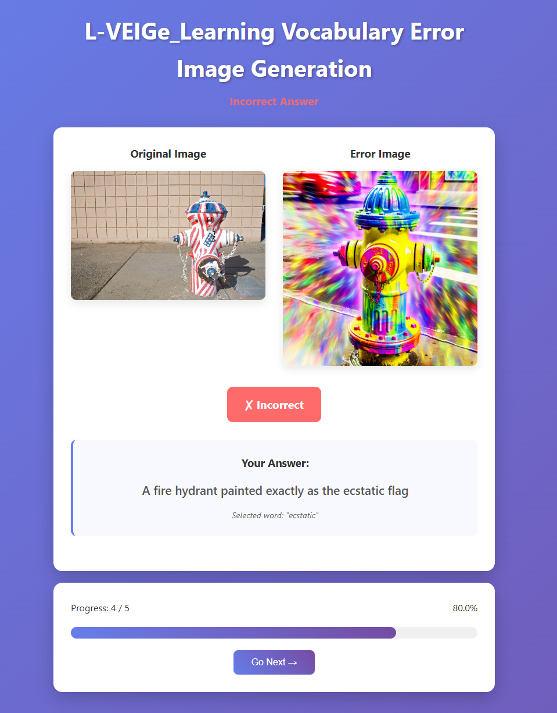
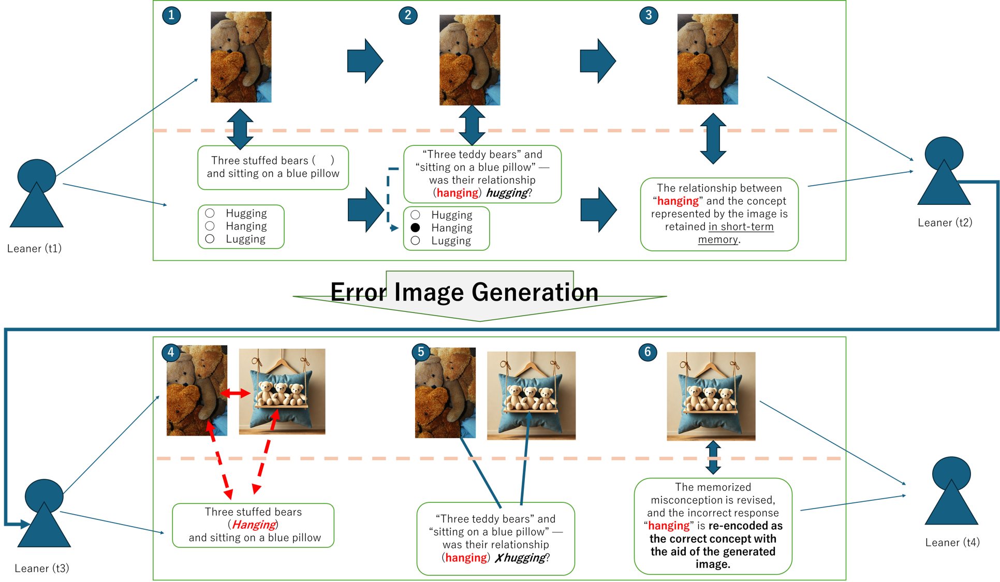

<h1 align="center">📚 L-VEIGe — Learning-Vocabulary Error Image Generation</h1>
<p align="center"><b>Interactive English vocabulary learning with visual feedback from error images</b></p>

<p align="center">
  <a href="#quickstart"></a>
  
  
  
  <a href="LICENSE"></a>
</p>

<p align="center">
  
  
</p>
<p align="center"><em>Left: Initial (Question) • Right: Result (Incorrect with error image)</em></p>

<div align="center">
  <a href="#quickstart">Quickstart</a> ·
  <a href="#features">Features</a> ·
  <a href="#how-it-works-design-intent">How it works</a> ·
  <a href="#license">License</a> ·
  <a href="CONTRIBUTING.md">Contributing</a>
</div>

<!-- # 📚 L-VEIGe (Learning-Vocabulary Error Image Generation) — Setup & Run (WSL/Windows + Linux/macOS)

An interactive web application for English vocabulary learning. It generates fill‑in‑the‑blank questions paired with COCO images and provides visual feedback for incorrect answers.

<p align="center">
  
  
</p>
<p align="center"><em>Left: Initial (Question) / Right: Result (Incorrect)</em></p> -->


## How it works (Design intent)

<p align="center">
  
</p>

This system couples **multimedia learning**, **cognitive load minimization**, and **error-based learning**.  
When a learner answers a fill-in-the-blank item, the app compares the chosen option with the target and—if it’s wrong—**generates an error image** for the selected word. Placing the original image and the error image side-by-side creates a clear **visual conflict** that makes the misconception obvious and easier to revise **without relying on L1 labels**.

**Flow (A–F in the figure):**
1. **Initial perception (A)** – The item, image, and three options are shown contiguously to reduce split-attention.
2. **Option selection (B)** – The learner forms a hypothesis; near-neighbor distractors (e.g., *hanging* vs. *hugging*) capture typical errors.
3. **Misconception (C, t1→t2)** – The wrong form is tentatively encoded with the visual context.
4. **Error visualization (D, t2→t3)** – An image for the wrong word induces cognitive conflict.
5. **Error recognition (E)** – The visual contrast reveals the semantic mismatch (e.g., *hanging* ≠ the original *hugging* scene).
6. **Conceptual reconstruction (F, t3→t4)** – The mapping is re-encoded toward the correct concept with less L1 dependence.


---

## ✨ Key Features

* 📚 **Fill‑in‑the‑blank items** with COCO images
* 🎯 **Adaptive distractors** (Levenshtein distance, CEFR level)
* 🖼️ **Error‑image generation** using **OpenAI Images (DALL·E 3)**
* 📊 **Learning analytics**: personal history & progress
* 🔄 **Review mode** for items you previously missed
* 💾 **SQLite persistence** for items, answers, images

> Language note: UI & docs are in English. Some inline source comments remain in Japanese.

---

## ✅ Supported / Recommended Environment

* **OS**: Windows 10/11 + **WSL2 (Ubuntu 22.04/24.04)**, or native Linux/macOS
* **Python**: **3.8.x required**
  The current dependency pins (e.g., `numpy==1.24.4`, `pandas==2.0.3`, spaCy 3.5.x) target Python 3.8. Running on 3.12 will fail.
* **RAM**: 2 GB+ recommended
* **Disk**: 1 GB+ (more if you store many images)
* **Editor**: VS Code (Remote — WSL recommended on Windows)

### Windows ⇄ WSL Path Mapping

| Purpose               | WSL path                                 | Windows path                                |
| --------------------- | ---------------------------------------- | ------------------------------------------- |
| Project root          | `/mnt/c/L-VEIGe_Original`                | `C:\L-VEIGe_Original`                       |
| Static images         | `/mnt/c/L-VEIGe_Original/static/images3` | `C:\L-VEIGe_Original\static\images3`        |
| `.env`                | `/mnt/c/L-VEIGe_Original/.env`           | `C:\L-VEIGe_Original\.env`                  |
| Virtual env (example) | `/home/<user>/.venvs/lveige38`           | `\\wsl$\Ubuntu\home\<user>\.venvs\lveige38` |

> **Tip**: Keep the virtualenv on the **Linux home side** (e.g., `~/.venvs/...`). Creating it under `/mnt/c` can cause permission/execute‑bit issues and slower builds.

---

## 🚀 Quick Start (WSL/Windows)

Run these in a **WSL (Ubuntu)** terminal.

### 1) Install Python 3.8

**A. apt (if sudo is available)**

```bash
sudo apt update
sudo apt install -y python3.8 python3.8-venv python3.8-distutils python3.8-dev build-essential
python3.8 -V  # 3.8.x
```

**B. Conda (no sudo / locked‑down machines)**

```bash
cd ~
wget https://repo.anaconda.com/miniconda/Miniconda3-latest-Linux-x86_64.sh -O miniconda.sh
bash miniconda.sh -b -p $HOME/miniconda
source "$HOME/miniconda/etc/profile.d/conda.sh"
conda create -n lveige38 python=3.8 -y
conda activate lveige38
```

### 2) Create & activate a virtualenv (apt route)

```bash
mkdir -p ~/.venvs
python3.8 -m venv ~/.venvs/lveige38 || true
# If your distro’s ensurepip is broken, fall back to manual pip:
python3.8 -m venv --without-pip ~/.venvs/lveige38
source ~/.venvs/lveige38/bin/activate
wget -O get-pip.py https://bootstrap.pypa.io/pip/3.8/get-pip.py
python get-pip.py && rm get-pip.py
```

### 3) Install dependencies

```bash
cd /mnt/c/L-VEIGe_Original
python -V
python -m pip -V
# Remove a spurious freeze artifact if present
sed -i '/^pkg_resources==0\.0\.0$/d' requirements-lock-py38.txt 2>/dev/null || true
python -m pip install --upgrade pip
python -m pip install -r requirements-lock-py38.txt || python -m pip install -r requirements.txt
```

### 4) Prepare `.env` (MUST be UTF‑8 without BOM)

```bash
echo "FLASK_SECRET_KEY=$(python -c 'import secrets; print(secrets.token_hex(32))')" > .env
echo "OPENAI_API_KEY=your_openai_api_key_here" >> .env
```

Open `.env` in VS Code and **Save with Encoding → UTF‑8**.

> If saved as UTF‑16 by Windows Notepad, you’ll get `UnicodeDecodeError: byte 0xff…` on startup.

### 5) Place static images

Filenames are expected like `000000xxxxxxxx.jpg` (12 digits, zero‑padded), under:

```
static/images3
```

Examples:

```bash
mkdir -p static/images3
cp /path/to/your/images/000000*.jpg static/images3/
ls static/images3 | head
```

If your dataset is large and lives under Linux home, a symlink is handy:

```bash
ln -s ~/datasets/coco2017/train2017 static/images3
```

### 6) Run the app

```bash
python -m flask --app app run --host 0.0.0.0 --port 5000
# or
# python app.py
```

Open: [http://127.0.0.1:5000](http://127.0.0.1:5000)

---

## 📦 Alternative Install (native Linux/macOS)

```bash
git clone <repository-url>
cd L-VEIGe_Original  # or your repo name
python3.8 -m venv .venv38
source .venv38/bin/activate
python -m pip install --upgrade pip
python -m pip install -r requirements.txt
python -m spacy download en_core_web_sm  # if not bundled in requirements-lock
```

Then follow steps **4–6** above for `.env`, images, and running.

---

## 📁 Project Structure (simplified)

```
L-VEIGe_Original/
├── app.py
├── requirements.txt / requirements-lock-py38.txt
├── .env                       # not committed
├── database/
│   └── db_manager.py
├── modules/
│   ├── enhanced_question_gen.py
│   ├── enhanced_candidate_gen.py
│   ├── enhanced_image_gen.py
│   └── result_processor.py
├── templates/
│   ├── base.html
│   ├── login.html
│   ├── question.html
│   ├── result.html
│   └── admin.html
├── static/
│   ├── images3/               # place COCO-like images here
│   └── placeholder.jpg
├── data/
│   ├── coco_cefr_vocab.csv
│   └── captions_val2017_sample10.json
└── tests/
    ├── test_system.py
    └── individual_tests.py
```

---

## 🧪 Testing

```bash
python tests/test_system.py          # end‑to‑end
python tests/individual_tests.py     # component‑level
python -m pytest tests/ -v           # optional, if pytest present
```

---

## 🔧 Troubleshooting (common)

* **`ModuleNotFoundError: No module named 'flask'`**
  You likely installed into a different environment. Use `python -m pip install ...` so pip matches the active interpreter.

* **`UnicodeDecodeError: 'utf-8' codec can't decode byte 0xff …`**
  `.env` is UTF‑16. Re‑save as **UTF‑8 (no BOM)** in VS Code, or run:
  `iconv -f utf-16 -t utf-8 .env -o .env.utf8 && mv .env.utf8 .env && dos2unix .env 2>/dev/null || true`

* **Static images return 404** (`GET /static/images3/000000xxxxx.jpg 404`)
  Files aren’t present or the path is wrong. Place real images under `static/images3` and verify exact 12‑digit names.

* **C‑extension build errors** (`Python.h: No such file or directory`, packages like `cymem`, `murmurhash`, `preshed`)
  Install headers and toolchain, then retry:
  `sudo apt update && sudo apt install -y build-essential python3.8-dev`

* **Pip fails on `pkg_resources==0.0.0`**
  Remove that single line from the lock file; it’s a harmless freeze artifact.

* **Creating venv under `/mnt/c` raises `Operation not permitted`**
  Put venv under Linux home (`~/.venvs/lveige38`). If you must use `/mnt/c`, enable metadata in `/etc/wsl.conf` and restart WSL.

* **Port already in use**
  Run on a different port with `--port 5050`, or find & stop the process:
  `ss -lptn 'sport = :5000'`

* **OpenAI image generation fails**
  Ensure `OPENAI_API_KEY` is set; check any feature flags in `modules/enhanced_image_gen.py`; verify network/quota.

---

## 🔐 Production Notes

```bash
export FLASK_SECRET_KEY="your_production_secret_key"
export OPENAI_API_KEY="your_production_api_key"
export FLASK_ENV=production
export FLASK_DEBUG=False
```

* Do **not** commit `.env` (`.gitignore` should exclude it).
* Use a real WSGI server (e.g., gunicorn) + reverse proxy in production.

---

## 🗺️ Roadmap (examples)

* User authentication
* Richer analytics & recommendations
* Text‑to‑speech support
* Mobile‑friendly UI

---
## Acknowledgments
This work was supported by **JST SPRING, Grant Number JPMJSP2102**. :contentReference[oaicite:2]{index=2}

## 📄 License
- **Code**: MIT License (see [LICENSE](./LICENSE))
- **Docs & Images (repo)**: CC BY 4.0, unless otherwise noted
- **COCO images**: Not redistributed in this repository. Please obtain the dataset from the original source and follow its licenses.
- **AI-generated images**: Use governed by the image provider’s latest terms.

##  🤝Contributing
See [CONTRIBUTING.md](./CONTRIBUTING.md). We welcome issues and pull requests!
